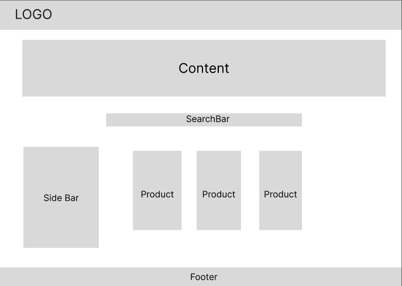
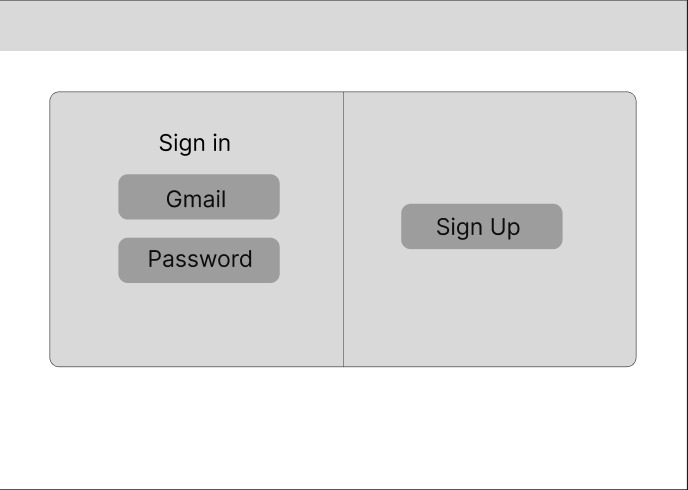
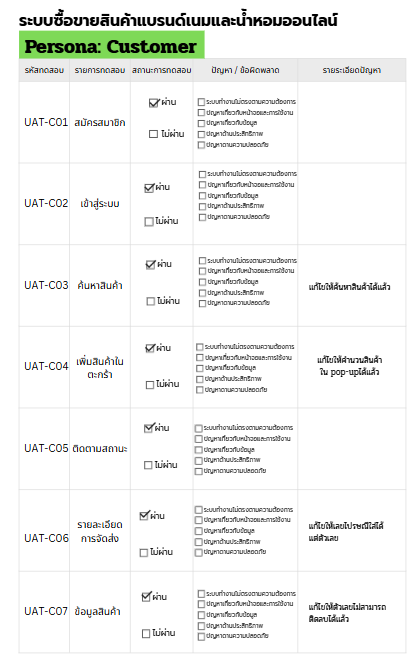
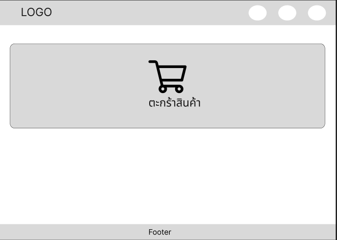
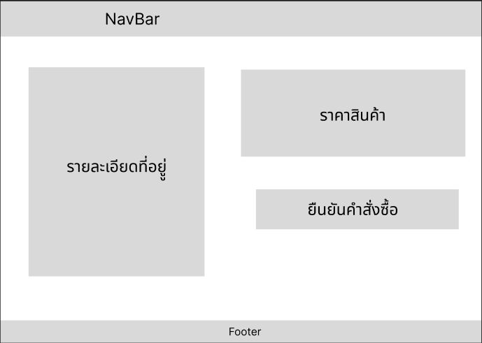
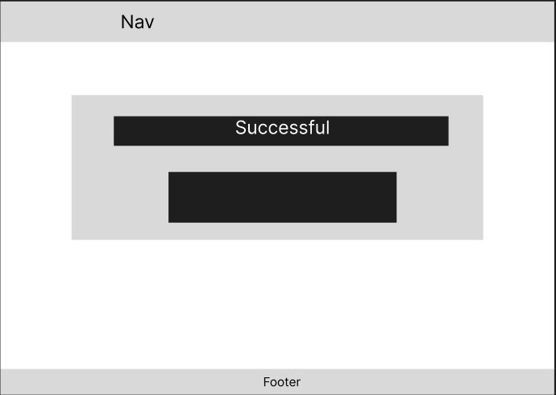
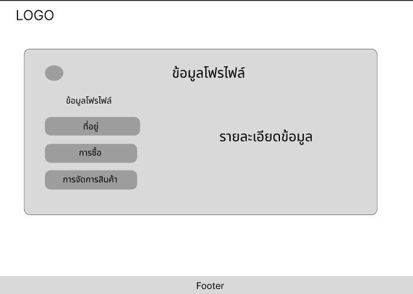
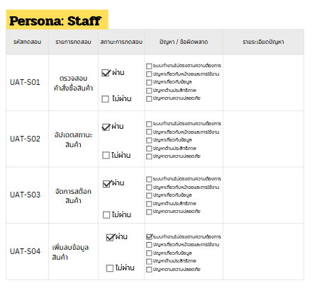
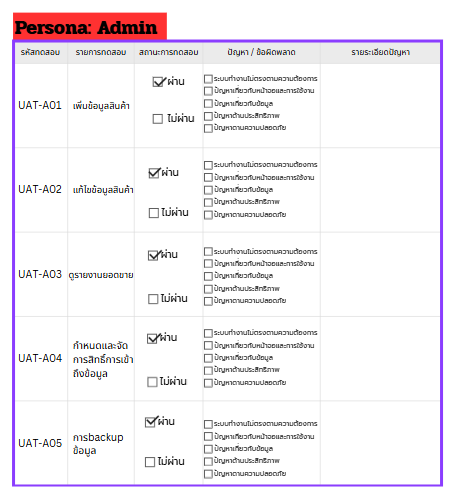

# สินค้าแบรนด์เนมและเครื่องสำอาง

---

# วิธีติดตั้งโปรเจค (Installation)

## 1. ติดตั้ง Backend
```bash
cd back
npm install
```

## 2. สร้างบัญชี Admin เริ่มต้น
```bash
node scripts/seedAdmin.js
```
ค่าเริ่มต้น: `admin@gmail.com` / รหัสผ่าน `admin` (เปลี่ยนได้ผ่าน ENV: `SEED_EMAIL`, `SEED_PASSWORD`, `SEED_NAME`) — บันทึกลง `back/data/users.json`

## 3. รัน Backend
```bash
npm start
```
เซิร์ฟเวอร์จะรันที่ `http://localhost:4000`

## 4. ติดตั้งและรัน Frontend
เปิด Terminal ใหม่อีกหน้าต่าง:
```bash
cd front
npm install
npm run dev
```
เว็บจะรันที่ `http://localhost:5173` (ตาม Vite default)

จากนั้นเข้าสู่ระบบด้วยบัญชี Admin ที่สร้างไว้ในขั้นตอนที่ 2 ได้ทันที

---

# Table of Contents

- [1. ผู้มีส่วนร่วม (Contributors)](#1-ผู้มีส่วนร่วม-contributors)
- [2. หลักการและเหตุผล (Rationale)](#2-หลักการและเหตุผล-rationale)
- [3. วัตถุประสงค์ของโครงงาน (Objectives)](#3-วัตถุประสงค์ของโครงงาน-objectives)
- [4. ขอบเขตของระบบ (System Scope)](#4-ขอบเขตของระบบ-system-scope)
- [5. แนวทางของการพัฒนาตาม SDLC](#5-แนวทางของการพัฒนาตาม-sdlc)
- [6. Tech Stack](#6-tech-stack)
- [7. แนวทางการทดสอบ (Testing Approach)](#7-แนวทางการทดสอบ-testing-approach)
- [8. ผลลัพธ์ที่คาดว่าจะได้รับ (Expected Outcomes)](#8-ผลลัพธ์ที่คาดว่าจะได้รับ-expected-outcomes)
- [9. แผนการดำเนินงาน 4 สัปดาห์ (Work Plan)](#9-แผนการดำเนินงาน-4-สัปดาห์-work-plan)
- [10. Requirement](#10-requirement)
- [11. User Personas](#11-user-personas)
- [12. Use Case Diagram](#12-use-case-diagram)
- [13. Class Diagram](#13-class-diagram)
- [14. Sequence Diagram](#14-sequence-diagram)
- [15. Wireframe](#15-wireframe)
- [16. Prototype](#16-prototype)
- [17. UAT](#17-uat)
- [18. Data Schema](#18-data-schema)

---

# 1. ผู้มีส่วนร่วม (Contributors)

| Name | Student ID | Role | GitHub |
|------|------------|------|--------|
| นวมินทร์ รัตนเศวตศักดิ์ | 67164374 | ระบบสมาชิก | @KiNgFoRrEd |
| ณธกฤต กวินสัจจาเดช | 67158212 | ระบบสั่งซื้อสินค้า | @PoohOnsen |
| ณัฐภูมิ ใจฮวย | 67158116 | ระบบตะกร้าสินค้า | @NakataX1 |
| รนินท์โชติ รัฐศิลป์วรกุล | 67154596 | รายละเอียดสินค้า | @Leocannady01z |
| ทิวัตถ์ ศิริเชื่อ | 67156414 | ผู้ดูแลระบบ | @ttwsrq |

---

# 2. หลักการและเหตุผล (Rationale)

- ปัจจุบันการซื้อขายสินค้าแบรนด์เนมและน้ำหอมผ่านช่องทางออนไลน์ได้รับความนิยมสูงขึ้นอย่างมาก ทั้งสินค้ามือหนึ่งและสินค้ามือสอง โครงงานนี้จึงจัดทำขึ้นเพื่อพัฒนาแพลตฟอร์ม e-Commerce ที่รองรับทั้งการซื้อสินค้าใหม่และการส่งต่อสินค้ามือสองของผู้ใช้งาน เพื่อสร้าง Community ของคนรักแบรนด์เนมที่ครบวงจรและใช้งานง่าย

---

# 3. วัตถุประสงค์ของโครงงาน (Objectives)

1. เพื่ออำนวยความสะดวกให้ผู้ใช้งานสามารถค้นหาและเลือกซื้อสินค้าแบรนด์เนมได้รวดเร็ว
2. เพื่อพัฒนาระบบรองรับการซื้อ-ขายสินค้าแบรนด์เนมทั้งมือหนึ่งและมือสอง
3. เพื่อศึกษาและประยุกต์ใช้กระบวนการพัฒนาซอฟต์แวร์ในการสร้างระบบสารสนเทศ

---

# 4. ขอบเขตของระบบ (System Scope)

- ล็อคอิน / สมัครสมาชิก
- การค้นหาสินค้า / กรองสินค้า (มือหนึ่ง/มือสอง)
- การดูรายละเอียดสินค้า
- การจัดการตะกร้าสินค้า
- ระบบสั่งซื้อสินค้า
- ระบบชำระเงิน
- ระบบจัดการข้อมูลสินค้า (รวมถึงระบบลงขายสินค้ามือสอง)
- ดูประวัติการสั่งซื้อ

## User Roles

| Role |
|------|
| Admin |
| Customers |
| Manager |

---

# 5. แนวทางของการพัฒนาตาม SDLC

## SDLC Model

### Phase 1 - Planning
ประชุมวางแผนกำหนดขอบเขตระบบ แบ่งหน้าที่รับผิดชอบและกำหนดกรอบเวลา

### Phase 2 - Analysis
วิเคราะห์ความต้องการระบบ รวบรวมข้อมูลพฤติกรรมของผู้ซื้อและผู้ขายมือสอง

### Phase 3 - Design
ออกแบบสถาปัตยกรรมข้อมูล โครงสร้างระบบแผนภาพ Flowchart ด้วย Draw.io และออกแบบหน้าจอติดต่อผู้ใช้ (UI/UX) ด้วย Figma

### Phase 4 - Development
เขียนโปรแกรมฝั่ง Frontend ด้วย React และ Tailwind CSS เชื่อมต่อกับ Backend Node.js และจัดการข้อมูลผ่าน Local Storage

### Phase 5 - Testing
ดำเนินการทดสอบระบบผ่านเครื่องมือ Postman ทำ Manual Testing และ UAT ตรวจสอบบั๊กและแก้ไขลอจิกให้ถูกต้อง

### Phase 6 - Deployment
จัดเตรียมโครงสร้างแพลตฟอร์มเพื่อส่งมอบงาน บูรณาการระบบหน้าบ้านและหลังบ้านให้ทำงานร่วมกัน

### Phase 7 - Maintenance
สรุปผลการพัฒนา ตรวจสอบเสถียรภาพของการจัดเก็บข้อมูลใน Local Storage และจัดทำเอกสารประกอบรายงาน

---

# 6. Tech Stack

## Frontend
- REACT VITE
- TAILWIND CSS

## Backend
- Node.js

## Database
- Local Storage

## DevOps
- GitHub Actions

## Tools
- Figma, Postman, VS Code, Git Desktop, Manual Testing

---

# 7. แนวทางการทดสอบ (Testing Approach)

## Testing Types
- Functional Testing
- API Testing
- User Acceptance Testing (UAT)
- Manual Testing

---

# 8. ผลลัพธ์ที่คาดว่าจะได้รับ (Expected Outcomes)

1. ได้ระบบซื้อขายสินค้าแบรนด์เนมที่รองรับการซื้อ-ขายมือสอง
2. ผู้ใช้งานสามารถค้นหา เลือกซื้อ และลงประกาศขายสินค้าได้อย่างสะดวก
3. ผู้ดูแลระบบสามารถตรวจสอบความเรียบร้อยของรายการสินค้าได้
4. ผู้พัฒนาได้รับความรู้และประสบการณ์ในการออกแบบและพัฒนาระบบ

---

# 9. แผนการดำเนินงาน 4 สัปดาห์ (Work Plan)

| Week | Tasks | Status |
|------|-------|--------|
| Week 1 | วิเคราะห์และออกแบบระบบ | วิเคราะห์ฟังก์ชันการลงขายมือสอง, ออกแบบฐานข้อมูลและ UI |
| Week 2 | พัฒนา Frontend | สร้างโครงสร้างหน้าเว็บและฟอร์มลงประกาศขายสินค้า |
| Week 3 | พัฒนา Backend และฐานข้อมูล | พัฒนา RESTful API รองรับข้อมูลการลงขายสินค้ามือสอง |
| Week 4 | ทดสอบและนำเสนอผลงาน | ทำ API Testing, UAT, แก้ไขบั๊ก และเตรียมนำเสนอ |

---

# 10. Requirement

## Functional Requirements
- ระบบสมาชิก (Login/Register)
- ระบบค้นหาและเลือกสินค้า (มือหนึ่ง/มือสอง)
- ระบบลงประกาศขายสินค้า (สำหรับลูกค้าที่ต้องการปล่อยของมือสอง)
- ระบบตะกร้าสินค้าและการสั่งซื้อ
- ระบบจัดการสินค้าสำหรับ Admin และ Manager

## Non-functional Requirements
- Performance: ระบบตอบสนองรวดเร็ว
- Reliability: ความถูกต้องของข้อมูลสินค้า
- Usability: เมนูการลงประกาศขายต้องเข้าใจง่าย

---

# 11. User Personas

## 1. ลูกค้า (Customer)
### คุณแพรวา | อายุ 24 ปี
> *"ฉันมองหาแพลตฟอร์มที่ไว้ใจได้ในการซื้อน้ำหอมและกระเป๋าแบรนด์เนม และอยากมีพื้นที่ปล่อยของเก่าที่ไม่ได้ใช้ เพื่อเปลี่ยนเป็นเงินไปซื้อของใหม่"*

* **อาชีพ:** พนักงานบริษัทเอกชน
* **เป้าหมาย (Goals):**
    *   ค้นหาและกรองสินค้าตามสภาพ (มือหนึ่ง/มือสอง) ได้อย่างแม่นยำ
    *   ลงประกาศขายสินค้ามือสองด้วยขั้นตอนที่รวดเร็ว
    *   ติดตามสถานะการสั่งซื้อหรือสถานะการขายของตนเองได้แบบ Real-time
* **Pain Points:**
    *   แพลตฟอร์มส่วนใหญ่มีระบบซื้อขายที่ซับซ้อนเกินไป
    *   กังวลเรื่องความน่าเชื่อถือของผู้ขายรายย่อยในระบบ

## 2. พนักงาน (Staff)
### คุณมานะ | อายุ 30 ปี
> *"ผมมีหน้าที่จัดการข้อมูลสินค้าและอัปเดตสถานะการสั่งซื้อให้เป็นปัจจุบัน เพื่อให้ลูกค้าได้รับข้อมูลที่ถูกต้องที่สุด"*

* **อาชีพ:** พนักงานจัดการข้อมูลสินค้า
* **เป้าหมาย (Goals):**
    *   จัดการเพิ่มหรือลบข้อมูลสินค้าในระบบได้อย่างรวดเร็ว
    *   ตรวจสอบและอัปเดตสถานะการสั่งซื้อของลูกค้าให้เป็นปัจจุบัน
    *   ตรวจสอบข้อมูลสินค้ามือสองที่ลูกค้าส่งเข้ามาเพื่ออนุมัติการวางขาย
* **Pain Points:**
    *   ลูกค้ากรอกข้อมูลสินค้าไม่ครบถ้วน ทำให้เสียเวลาติดต่อสอบถาม
    *   ระบบการจัดการข้อมูลสินค้าบางจุดล่าช้า ส่งผลให้การอัปเดตสต็อกไม่ทันใจ

## 3. ผู้ดูแลระบบ (Admin)
### นายอภิสิทธิ์ (เก่ง) | อายุ 28 ปี
> *"ผมดูแลความปลอดภัยและเสถียรภาพของระบบ เพื่อมั่นใจว่าไม่มีมิจฉาชีพและข้อมูลลูกค้าต้องไม่รั่วไหล"*

* **อาชีพ:** ผู้ดูแลระบบไอที (System Administrator)
* **เป้าหมาย (Goals):**
    *   กำหนดและจัดการสิทธิ์การเข้าถึงข้อมูล (Role-based Access) ให้กับพนักงานได้อย่างเหมาะสม
    *   ดูแลความเสถียรของฐานข้อมูลและระบบการจัดการสินค้าให้พร้อมใช้งานเสมอ
    *   จัดการระบบ Log เพื่อตรวจสอบย้อนกลับหากเกิดความผิดปกติในระบบ
* **Pain Points:**
    *   ความท้าทายในการจัดการสิทธิ์หากระบบไม่มีความยืดหยุ่นเพียงพอ
    *   กังวลเรื่องความปลอดภัยของฐานข้อมูลเมื่อมีผู้ใช้งานเข้าถึงพร้อมกันจำนวนมาก

---

# 12. Use Case Diagram

## Diagram


---

# 13. Class Diagram

## Diagram


---

# 14. Sequence Diagram

## Diagram


---

# 15. Wireframe

หน้าจอจริงของระบบ (ทำงานได้จริงตาม Tech Stack ในหัวข้อ 6) เรียงตาม User Journey ตั้งแต่ลูกค้าเข้าเว็บจนถึงฝั่งผู้ดูแลระบบ

## หน้าแรก (Home)


## เข้าสู่ระบบ / สมัครสมาชิก (Login)


## หน้าลูกค้า (Customer)


## ตะกร้าสินค้า (Cart)


## ชำระเงิน (Checkout)


## คำสั่งซื้อ (Order)


## โปรไฟล์ผู้ใช้ (Profile)


## แผงควบคุมพนักงาน (Staff)


## แผงควบคุมผู้ดูแลระบบ (Admin)


---

# 16. Prototype

Interactive Prototype ของระบบ (ออกแบบด้วย Figma ตามหัวข้อ 5 Phase 3 และหัวข้อ 6 Tools)

🔗 [เปิด Prototype บน Figma](https://www.figma.com/design/J7rTOz15xG92mW4Utyk7M6/Untitled?node-id=0-1&t=ffph0NEylHI0zWEm-1)

---

# 17. UAT

ทดสอบแบบ User Acceptance Testing (UAT) โดยอ้างอิง Persona ทั้ง 3 คนจากหัวข้อ 11 (Customer/คุณแพรวา, Staff/คุณมานะ, Admin/นายอภิสิทธิ์) เขียน Test Case จากฟังก์ชันจริงของระบบ ไม่ใช่ Persona สมมติ เอกสารฉบับเต็มอยู่ที่ `docs/UAT_TestCase_5Paul.docx`

## สรุปผลการทดสอบ

| Persona | จำนวน Test Case | ผ่าน | ไม่ผ่าน |
|---------|:---:|:---:|:---:|
| Customer | 9 | 8 | 1 |
| Staff | 5 | 4 | 1 |
| Admin | 8 | 7 | 1 |
| **รวม** | **22** | **19** | **3** |

อัตราการผ่านการทดสอบ: **86.36%** (19/22)

## ปัญหาที่พบจากการทดสอบ

| Issue ID | รายละเอียดปัญหา | ระดับความสำคัญ |
|----------|-----------------|:---:|
| ISS-001 | หน้า Checkout ยังไม่มีช่องกรอก/ใช้งานคูปองส่วนลด | Medium |
| ISS-002 | สินค้ามือสองที่ลูกค้าโพสต์ขายเผยแพร่ขึ้นหน้าร้านทันที ไม่มีขั้นตอนให้ Staff ตรวจสอบ/อนุมัติก่อน | High |
| ISS-003 | ไม่มีหน้ารวม Log กิจกรรมของระบบสำหรับ Admin ตรวจสอบย้อนกลับ | Medium |

ควรแก้ไข ISS-002 เป็นลำดับแรก เนื่องจากตรงกับ Pain Point ของ Persona ลูกค้าที่กังวลเรื่องความน่าเชื่อถือของผู้ขายรายย่อยในระบบโดยตรง

---

# 18. Data Schema

ระบบเก็บข้อมูลจริง 2 ชั้นตาม Tech Stack ในหัวข้อ 6 (Database: Local Storage):

**ฝั่ง Backend (ไฟล์ JSON ใน `back/data/`)**
- `users.json` — บัญชีผู้ใช้ทุก Role เก็บเป็น object คีย์ด้วยอีเมล มีฟิลด์ name, email, password (เข้ารหัสด้วย bcrypt), role (Admin/Staff/Customer), status, phone, createdBy, createdAt
- `checkout_orders.json` — คำสั่งซื้อทุกใบ เก็บเป็น array มีฟิลด์ orderId, userId, placedByRole, items[], shippingAddress, paymentMethod/paymentStatus, subtotal/shippingFee/discount/grandTotal, status/statusHistory[], carrier/trackingNumber, createdAt/updatedAt
- `back/backups/backup-<timestamp>.json` — ไฟล์สำรองข้อมูลรายวัน (รวมไฟล์ทั้งหมดใน back/data มาไว้ในไฟล์เดียว) ใช้กู้คืนได้จากหน้า Admin

**ฝั่ง Frontend (localStorage ของเบราว์เซอร์)**
- `my_products` — สินค้าทั้งหมด ทั้งของบริษัท (source: company) และที่ลูกค้าลงขายเอง (source: customer) มีฟิลด์ productId, categoryId, title/brand/price/salePrice/stock/description/image, sellerEmail/sellerName
- `my_categories` — หมวดหมู่สินค้า (categoryId, categoryName)
- `my_inventory_logs` — ประวัติการปรับสต๊อกสินค้า (productId, type: in/out/adjust, qty, stockBefore/stockAfter, reason, actor: Staff/Customer, date)

ความสัมพันธ์ระหว่างข้อมูล: User 1 คนสั่งซื้อได้หลาย Order, แต่ละ Order มีสินค้าหลายรายการ (items[]) ที่อ้างอิงกลับไปยัง Product ด้วย productId, แต่ละ Product อยู่ใน Category เดียว และถ้าลูกค้าเป็นคนลงขายเอง (source=customer) จะอ้างอิงกลับไปยัง User ที่เป็นผู้ขายผ่าน sellerEmail ด้วย

## Diagram


